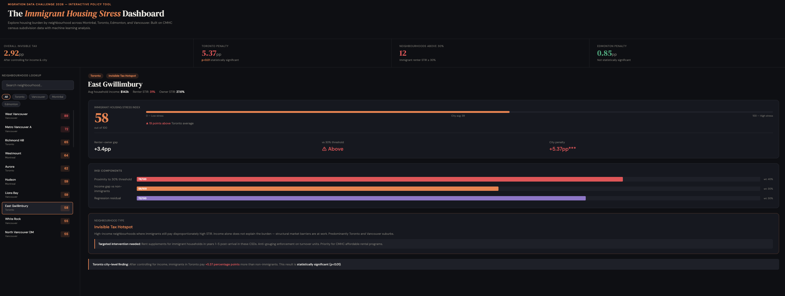

# The Invisible Tax: Immigrant Housing Burden Across Canadian Cities

## Overview

A data analysis project examining housing affordability disparities between immigrant and non-immigrant households across Montreal, Toronto, Edmonton, and Vancouver. Built for the Migration Data Challenge 2026 hosted by the Bridging Divides Research Program at Toronto Metropolitan University.

## Preview



## Key Finding

After controlling for income and city, immigrant households pay 2.92 percentage points more of their income on housing than non-immigrants. In Toronto that penalty reaches 5.37 percentage points — a statistically significant result that holds regardless of how much a household earns. We call this the Invisible Tax.

## Project Structure

```
migration-challenge/
├── data/
│   └── master_clean.csv
├── visuals/
│   ├── chart1_city_comparison.py
│   ├── chart2_invisible_tax.py
│   ├── chart3_renter_owner_gap.py
│   ├── chart4_top_csds.py
│   ├── chart5_income_stir_cities.py
│   ├── chart6_policy_summary.py
│   ├── ml_regression.py
│   ├── ml_clustering.py
│   ├── ml_stress_index.py
│   ├── ml_interaction.py
│   └── dashboard.html
├── report/
│   └── report.md
├── external_data/
│   └── cmhc_rental_market_2025.txt
└── analysis.py
```


## What We Built

### Six Descriptive Charts

Comparing housing burden across four cities, two tenure types, and two immigrant status groups. Twelve neighbourhoods exceed the 30% affordability threshold for immigrant renters. Every single one is in Toronto or Vancouver. Edmonton contributes zero.

### Linear Regression

Predicts STIR using income, city, and immigrant status. The coefficient on immigrant status after controlling for everything else is the Invisible Tax: 2.92 percentage points. R squared equals 0.645.

### Interaction Model

Estimates the immigrant penalty city by city after controlling for income.

| City | Immigrant Penalty | Statistically Significant |
|------|------------------|--------------------------|
| Toronto | +5.37pp | Yes, p less than 0.01 |
| Vancouver | +3.57pp | Yes, p less than 0.01 |
| Montreal | +0.85pp | No |
| Edmonton | +0.85pp | No |

The immigrant housing penalty is a Toronto and Vancouver problem, not a national one.

### K-Means Clustering

Groups 154 immigrant neighbourhoods into four types based on their full burden profile. Identifies a hidden Renter Trap cluster of 34 neighbourhoods whose average STIR looks affordable but whose renter STIR is severe. These places are invisible to conventional policy tools.

### Immigrant Housing Stress Index (IHSI)

An original composite index scoring every neighbourhood from 0 to 100 across three dimensions.

- Proximity to the 30% affordability threshold, weighted at 40 percent
- Income gap versus non-immigrants, weighted at 30 percent
- Regression residual, weighted at 30 percent

West Vancouver scores 89. Edmonton city scores 25.

### Interactive Dashboard

A self-contained HTML file. Open in any browser with no server or internet connection needed. Search any neighbourhood to see its IHSI score, component breakdown, cluster type, and tailored policy recommendation.

## Data

Source: Canada Mortgage and Housing Corporation census subdivision level housing data for Montreal, Toronto, Edmonton, and Vancouver.

External: CMHC Rental Market Report 2025, used to connect observed STIR gaps to the turnover rent premium mechanism. New tenants in Toronto paid 44 percent more than long-term tenants in 2024. Immigrants are almost always new tenants.

Note: Raw CMHC data files are not included in this repository. Only the cleaned analysis-ready dataset is provided.

## Setup

```bash
git clone https://github.com/YOUR_USERNAME/migration-challenge.git
```
```
cd migration-challenge
```
```
pip install pandas matplotlib seaborn scikit-learn statsmodels numpy
```
```
python analysis.py
```
```
python visuals/chart1_city_comparison.py
```
```
open visuals/dashboard.html
```

## Policy Recommendations

### Recommendation 1: Immigrant Rent Supplements

Target households in the top IHSI neighbourhoods in Toronto and Vancouver. Concentrate support in the first five years after landing when immigrants are most exposed to turnover rent premiums.

### Recommendation 2: Turnover Rent Transparency

Require landlords to disclose what the previous tenant paid at the point of signing a new lease. New tenants, who are disproportionately immigrants, need this information to challenge excessive rent increases.

### Recommendation 3: Renter Trap Neighbourhood Monitoring

Use the IHSI to identify and prioritize the 34 neighbourhoods where aggregate affordability data hides a severe renter-specific crisis. These places would never be flagged by conventional housing stress measures.

## Competition

Migration Data Challenge 2026
Bridging Divides Research Program
Toronto Metropolitan University
Submission deadline: May 11, 2026

## Authors
Diana Dadkhah Tirani, Gurveer Madurai, Jose Davila

Analysis, visualizations, index design, and interactive dashboard built for the Migration Data Challenge 2026.
